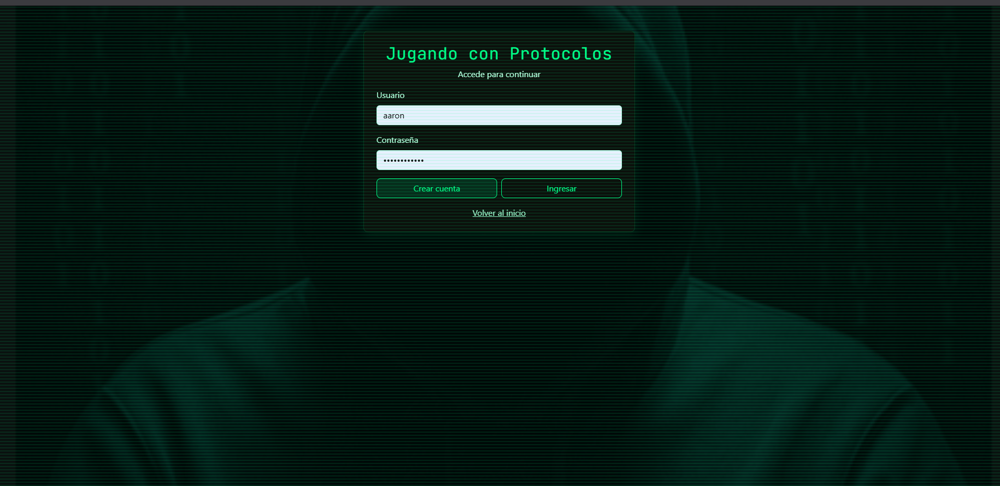
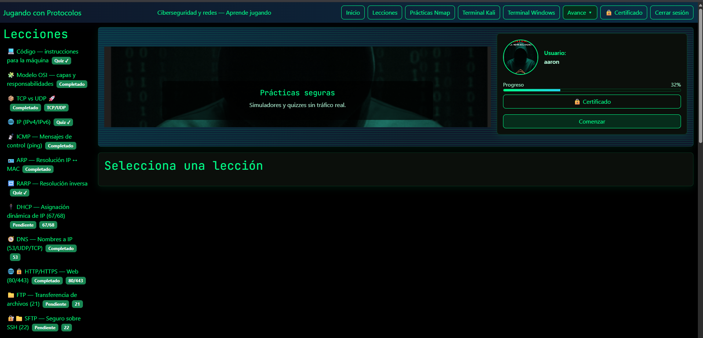
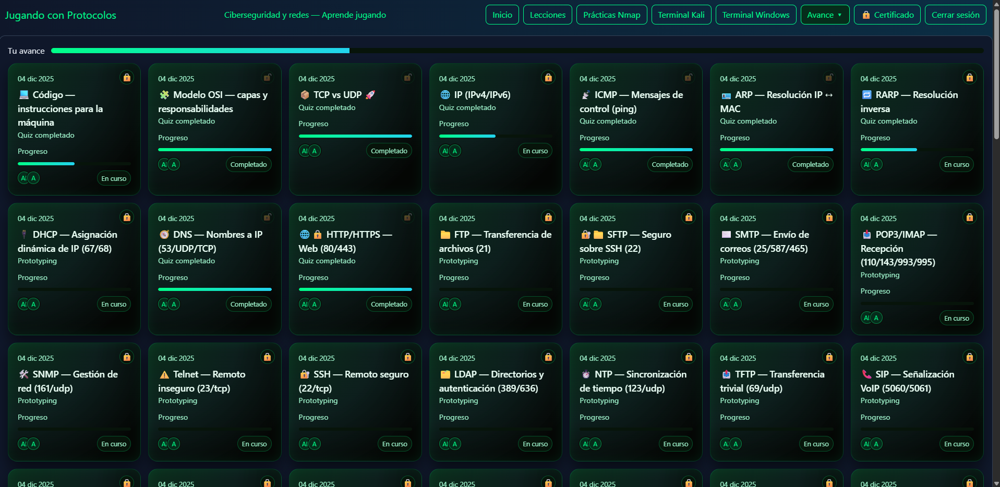
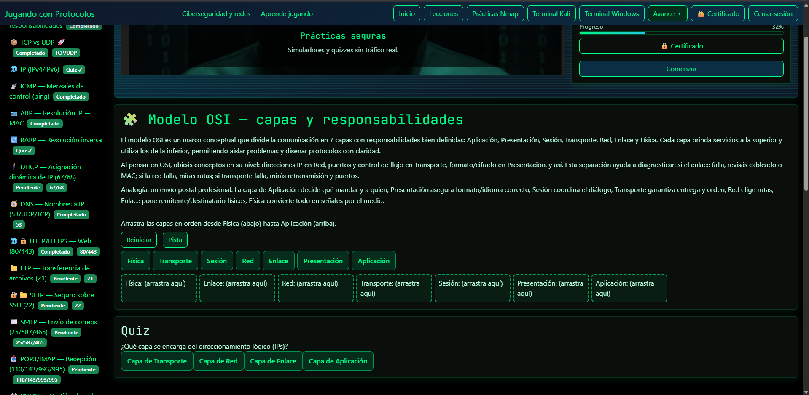
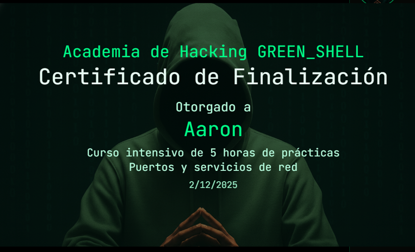

# Jugando con Protocolos — Prototipo educativo

Pequeña página estática para aprender protocolos de red jugando: lecciones, quizzes y un simulador simple.

Contenido del repositorio:

- `index.html` — interfaz principal
- `styles.css` — estilos
- `app.js` — lógica de la página (carga de lecciones, quiz, mini-juegos)
- `lessons.json` — lecciones y preguntas de ejemplo

Cómo ejecutar (Windows PowerShell):

```powershell
cd 'c:\Users\Aaron\Desktop\protocolos-jugando'
python -m http.server 8000
# luego abre http://localhost:8000 en tu navegador
```

Siguientes mejoras posibles:
- Añadir más lecciones y ejercicios interactivos
- Persistencia de progreso (localStorage) y perfiles
- Añadir retos/gamificación: puntos, niveles y badges
- Migrar a framework (React/Vue) si quieres una app más compleja

Si quieres, puedo añadir: más lecciones, un sistema de puntos o convertirlo a React.




